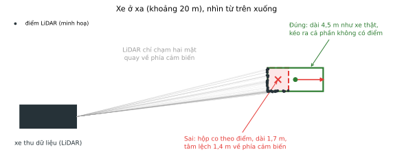
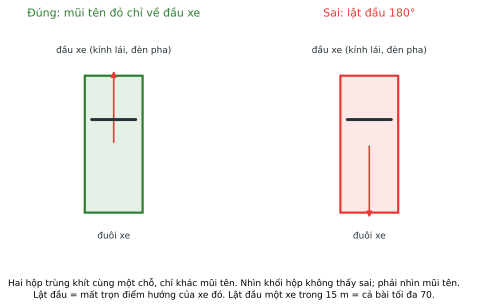
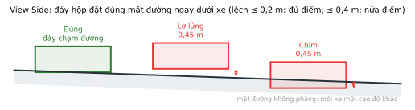
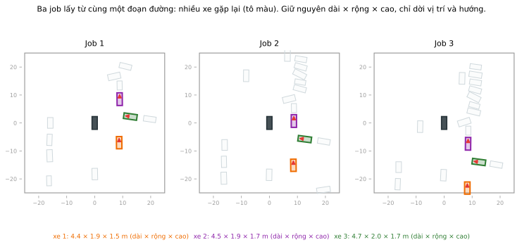

# LABEL_GUIDELINE.md — Quy tắc vẽ cuboid cho xe

Các quy tắc này lấy từ guideline gán nhãn 3D của dự án Robotaxi, rút gọn cho bài hôm nay. Đọc hết một lượt trước khi vẽ hộp đầu tiên.

Mỗi hộp có bảy thông số: **nhãn, tâm (x, y, z), dài, rộng, cao, hướng (yaw)**. Năm mục đầu dưới đây nói từng thông số phải đặt thế nào; mục 6 là thứ tự thao tác trong CVAT.

## ⚠️ Lỗi nặng nhất: lật đầu xe 180°

Hộp đúng chỗ, đúng cỡ nhưng mũi tên chỉ về **đuôi** xe. Nhìn khối hộp thì không thấy sai, vì hộp lật ngược vẫn trùng khít chỗ cũ. Với dữ liệu xe tự hành thì đây là lỗi nặng: mô hình học rằng xe đang chạy ngược chiều. Xem [mục 3](#3-hướng-hộp-mũi-tên-đỏ-chỉ-về-đầu-xe).

---

## 1. Vẽ gì, không vẽ gì

| Vật thể | Nhãn | Hôm nay |
| --- | --- | --- |
| Ô tô con, bán tải, van, SUV | `vehicles` | **Bắt buộc, được chấm** |
| Xe tải, xe buýt, xe khách | `vehicles` | **Bắt buộc, được chấm** |
| Xe máy, xe đạp | `two-wheels` | Không bắt buộc, không chấm |
| Người đi bộ | `pedestrian` | Không bắt buộc, không chấm |
| Động vật, vật cản | `Animal`, `Obstacle` | Không bắt buộc, không chấm |

- Vẽ **mọi** xe bốn bánh trở lên có tâm nằm trong vùng 50 m × 50 m: đang chạy, đang dừng đèn đỏ, đang đỗ ven đường, chạy ngược chiều.
- Xe nằm sát mép vùng, bị cắt mất một phần điểm: vẫn vẽ, và vẽ đủ kích thước xe thật. Hộp có tâm nằm ngoài vùng thì không được tính.
- Xe bị xe khác che một phần: vẫn vẽ, đoán phần bị che theo kích thước xe thật.
- Mỗi xe đúng **một** hộp. Không vẽ hai hộp chồng lên một xe.
- Xe máy không phải `vehicles`. Hộp `vehicles` đặt lên xe máy sẽ bị tính là vẽ thừa.

Sơ đồ dưới là một frame thật nhìn từ trên xuống, vẽ lại từ toạ độ hộp trong đáp án. Không có point cloud trong hình.

## 2. Bao trọn thân xe, kể cả phần không có điểm

Hộp ôm **cả chiếc xe thật**, không chỉ phần điểm nhìn thấy.

LiDAR chỉ chạm các mặt xe quay về phía cảm biến. Xe càng xa, điểm càng thưa và dồn về một hai mặt gần. Nếu co hộp theo đúng mảng điểm, hộp sẽ ngắn và hẹp hơn xe thật, tâm lệch về phía xe thu dữ liệu.

Kích thước tham khảo, đo từ các xe trong bộ dữ liệu này:

| Loại | Dài | Rộng | Cao |
| --- | --- | --- | --- |
| Ô tô con, SUV, bán tải | 3,3 – 5,0 m | 1,7 – 2,2 m | 1,5 – 2,3 m |
| Xe tải nhỏ | khoảng 5,4 m | khoảng 2,3 m | khoảng 2,9 m |

Hộp của bạn cho một chiếc ô tô con mà chỉ dài 2 m hoặc rộng 1 m thì gần như chắc chắn đang co theo điểm.

**Không dư quá mức.** Không bao gương chiếu hậu, cửa đang mở, điểm mặt đường, hay điểm của vật bên cạnh (cột, cây, xe khác).

## 3. Hướng hộp: mũi tên đỏ chỉ về đầu xe

Trước khi vẽ, bật **Appearance → Cuboid orientation** ở panel bên phải. Mỗi hộp hiện mũi tên theo trục của nó.

- **Mũi tên đỏ chỉ về đầu xe.** Xe đang chạy: trùng hướng chạy. Xe đang đỗ: theo trục dọc thân xe, mũi tên vẫn về phía đầu.
- Cạnh dài của hộp nằm dọc thân xe. Xoay hộp cho cạnh dài song song với thân xe ở view Top.
- Không chắc đâu là đầu xe: mở ảnh camera hiển thị bên cạnh point cloud và tìm đèn pha, kính lái, biển số trước. Xe cùng làn với xe thu dữ liệu, cùng chiều chạy, thường có đầu chỉ cùng hướng với xe thu dữ liệu. Xe làn ngược chiều thì ngược lại.

Soát lại **từng** hộp ở view Top trước khi chuyển job sang completed. Chỉ cần một xe gần (dưới 15 m) bị lật đầu là cả bài bị chặn trần 70 điểm (xem [RUBRIC.md](RUBRIC.md)).

## 4. Đáy hộp đặt trên mặt đường

- Ở view Side và Front, kéo **đáy hộp chạm mặt đường ngay dưới bánh xe**. Không treo lơ lửng, không chìm xuống đường.
- Kéo **nắp hộp** tới điểm cao nhất của thân xe (nóc xe, không tính ăng-ten).
- Mặt đường không phẳng. Mỗi xe có cao độ khác nhau, nên đừng chép `z` từ xe này sang xe khác; xem điểm mặt đường dưới chính xe đó.

## 5. Cùng một xe, cùng một kích thước ở mọi job

Ba frame của bạn lấy từ cùng một đoạn đường, cách nhau vài giây. Nhiều xe xuất hiện ở hơn một job. Xe không co giãn, nên hộp của cùng một chiếc xe phải có **cùng dài, rộng, cao** ở mọi job.

Cách làm:

1. Ở job đầu, ghi lại dài × rộng × cao của vài xe dễ nhận (xe tải, xe màu lạ trên ảnh camera, xe đỗ cố định).
2. Ở job sau, gặp lại xe đó thì nhập đúng kích thước cũ, chỉ dời vị trí và xoay hướng.

Chênh lệch dưới 10% ở cả ba chiều là đạt.

## 6. Quy trình bốn view

Ba view Top, Side, Front là cùng một hộp nhìn từ ba phía. Sửa ở view này, hai view kia đổi theo.

1. **View 3D.** Orbit, zoom, pan để tìm đúng cụm điểm của xe. Dùng để nhìn hộp có ôm khối hay đang hở một phía. Không chốt số ở view này.
2. **Top.** Kéo bốn cạnh cho khớp thân xe: tâm x, y, dài, rộng. Xoay hộp cho **mũi tên đỏ chỉ về đầu xe**.
3. **Side và Front.** Kéo đáy chạm mặt đường, kéo nắp theo điểm cao nhất: đây là chỗ chỉnh `z` và chiều cao.
4. **Đọc lại bảy thông số**: nhãn, tâm, dài, rộng, cao, hướng. Kích thước có hợp lý với loại xe không? Mũi tên có đúng đầu không? Rồi mới sang xe kế.

Mẹo quét cho khỏi sót: bắt đầu từ các xe gần xe thu dữ liệu, rồi đi vòng ra xa theo từng làn đường, cuối cùng soát bốn mép vùng.

## 7. Lỗi hay gặp

| # | Lỗi | Hậu quả | Cách tránh |
| --- | --- | --- | --- |
| 1 | **Lật đầu 180°** | Mất trọn điểm hướng của xe đó; xe gần thì cả bài tối đa 70 | Soát mũi tên từng hộp ở view Top |
| 2 | **Bỏ sót xe gần** | Hơn 10% xe gần bị sót thì cả bài tối đa 60 | Quét vòng quanh xe thu dữ liệu trước |
| 3 | **Hộp co theo điểm** ở xe xa | Tâm lệch, kích thước sai, mất điểm chất lượng hộp | Kéo hộp đủ kích thước xe thật ([mục 2](#2-bao-trọn-thân-xe-kể-cả-phần-không-có-điểm)) |
| 4 | **Sót xe ở mép vùng**, xe bị che, xe chạy ngược chiều | Mất điểm phát hiện | Soát bốn mép vùng và làn ngược chiều |
| 5 | **Cùng xe, mỗi job một kích thước** | Mất điểm nhất quán kích thước | Ghi lại kích thước, nhập lại ở job sau |
| 6 | **Hộp vẽ vào khoảng trống** | Mất điểm không vẽ thừa | Kiểm tra trong hộp có cụm điểm thật |
| 7 | **Đáy hộp lơ lửng hoặc chìm** | Mất điểm đáy chạm đường | Chỉnh đáy ở view Side, Front |
| 8 | **Hộp `vehicles` trên xe máy** | Bị tính là vẽ thừa | Xe máy dùng `two-wheels` hoặc bỏ qua |
