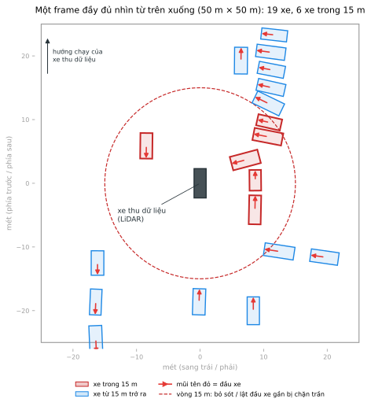

# Ngày 12 — Vẽ cuboid 3D cho xe trên point cloud LiDAR

Hôm nay bạn gán nhãn 3D: vẽ hộp (cuboid) quanh từng chiếc xe trong point cloud LiDAR, đúng vị trí, đúng kích thước và đúng hướng đầu xe. Đây là loại nhãn dùng để huấn luyện mô hình phát hiện vật thể 3D cho xe tự hành.

| Tài liệu | Đọc khi nào |
| --- | --- |
| README.md (file này) | Đầu buổi: vào bài, các bước làm, cách nộp, câu hỏi hay gặp |
| [LABEL_GUIDELINE.md](LABEL_GUIDELINE.md) | Trước khi vẽ hộp đầu tiên, và mỗi khi không chắc |
| [RUBRIC.md](RUBRIC.md) | Muốn biết bài được chấm thế nào |

## ⚠️ Bảo mật dữ liệu

Point cloud và ảnh camera trong bài là dữ liệu thật của VinFast, chỉ được dùng trong buổi lab này.

- Không tải dữ liệu về máy, không chụp hay quay màn hình point cloud và ảnh camera.
- Không đăng lên mạng xã hội, Discord, VLearn hay nhóm chat.
- Không đưa tài khoản CVAT cho người khác.
- Không chia sẻ repo này ra ngoài lớp.

Các sơ đồ trong repo được vẽ lại trên nền trắng từ toạ độ hộp. Chúng không chứa point cloud, ảnh camera hay người thật.

## Vào bài

1. Mở [https://cvat.note.transformerlabs.ai](https://cvat.note.transformerlabs.ai), đăng nhập bằng tài khoản lớp. **Username là MSSV** (ví dụ `2A202602041`).
2. Bấm tên tài khoản ở góc phải trên và chọn organization **`ai20k-labs`**. Job của bạn nằm trong organization này; nếu đang ở Personal workspace thì danh sách job sẽ trống.
3. Mở mục **Jobs** (không mở mục Tasks). Bạn có **ba job**, mỗi job là một frame point cloud.
4. Bấm vào thẻ job để vào trang vẽ. Địa chỉ đúng có dạng `/tasks/<số task>/jobs/<số job>`.

Trang task (`/tasks/<số>`) sẽ báo không có quyền. Đó là đúng: học viên chỉ làm job được giao, không mở trang quản lý của cả task.

## Mỗi job cần làm gì

Point cloud đã được cắt còn hình vuông **50 m × 50 m** quanh xe thu dữ liệu. Vẽ một cuboid nhãn **`vehicles`** cho **mọi** xe từ bốn bánh trở lên trong vùng đó: ô tô con, bán tải, van, xe tải, xe buýt. Xe đang chạy hay đang đỗ đều phải vẽ.

- Mỗi frame thường có **8 đến 19 xe**. Xe nào trong vùng cũng có ít nhất vài chục điểm, nên không có xe nào "quá thưa để bỏ qua".
- Job mở ra trống, không có hộp sẵn để sửa.
- Xe máy, xe đạp, người đi bộ, động vật, vật cản: không bắt buộc hôm nay và không được chấm. Xe máy là nhãn `two-wheels`, không phải `vehicles`.
- Chia thời gian cho đủ ba job. Ba job chấm ngang nhau, bỏ trống một job là mất một phần ba điểm các hạng mục.

## Các bước trong CVAT

1. **Bật mũi tên hướng.** Panel bên phải → **Appearance** → tích **Cuboid orientation**. Mỗi cuboid hiện mũi tên theo trục của hộp; xoay hộp sao cho **mũi tên đỏ chỉ về đầu xe**.
2. **Tạo hộp.** Ở thanh công cụ bên trái chọn công cụ vẽ cuboid, chọn nhãn `vehicles`, rồi đặt hộp lên cụm điểm của xe trong view 3D.
3. **Chỉnh hộp bằng bốn view.** Làm theo thứ tự ở [LABEL_GUIDELINE.md — Quy trình bốn view](LABEL_GUIDELINE.md#6-quy-trình-bốn-view): Top để chỉnh vị trí, dài, rộng, hướng; Side và Front để chỉnh đáy và chiều cao.
4. **Save thường xuyên** (`Ctrl+S`). Trang 3D nặng, trình duyệt có thể treo; phần chưa Save sẽ mất.
5. Hết xe trong frame thì đối chiếu [checklist](#checklist-trước-khi-chuyển-completed), rồi sang job tiếp theo.

## Checklist trước khi chuyển completed

Làm cho từng job:

- [ ] Đã quét hết vùng 50 m × 50 m, kể cả **mép vùng**, xe bị che một phần, xe chạy ngược chiều.
- [ ] Mọi hộp đều là nhãn `vehicles` (trừ các hộp bạn cố ý vẽ thêm cho lớp khác).
- [ ] **Mũi tên đỏ của mọi hộp chỉ về đầu xe.** Soát lại từng hộp ở view Top.
- [ ] Hộp xe xa có đủ kích thước xe thật, không co theo mảng điểm.
- [ ] Đáy hộp chạm mặt đường ở view Side hoặc Front.
- [ ] Không có hộp nào vẽ vào khoảng trống.
- [ ] Xe đã vẽ ở job trước thì giữ nguyên dài, rộng, cao.
- [ ] Đã **Save**.

## Nộp bài

Không nộp file. Trong **từng job**:

1. Save.
2. Chuyển trạng thái job sang **completed**.

Coach lấy bài trực tiếp trên server và chấm sau buổi, dùng bản Save cuối cùng. Đáp án không nằm trên task.

## Câu hỏi hay gặp

**Không thấy job nào trong mục Jobs.** Kiểm tra organization đang chọn là `ai20k-labs` (bước 2 ở mục Vào bài). Vẫn không thấy thì báo coach kèm MSSV.

**Không đăng nhập được, quên mật khẩu, hoặc tài khoản không đúng MSSV.** Báo coach ngay đầu buổi. Đừng tự tạo tài khoản mới: tài khoản mới không có job.

**Trang task báo không có quyền.** Bình thường. Vào bài qua mục Jobs.

**Point cloud giật, xoay chậm.** Mỗi frame khoảng 200 nghìn điểm. Đóng bớt tab và ứng dụng khác, dùng Chrome hoặc Edge bản mới. Vẫn không làm được thì báo coach.

**Lỡ chuyển completed nhưng muốn sửa.** Mở lại job, sửa, Save. Coach chấm theo bản Save cuối cùng.

**Không chắc đâu là đầu xe.** Mở ảnh camera hiển thị bên cạnh point cloud để xem đèn pha, kính lái, biển số. Xem thêm [LABEL_GUIDELINE.md — Hướng hộp](LABEL_GUIDELINE.md#3-hướng-hộp-mũi-tên-đỏ-chỉ-về-đầu-xe).

**Có cần vẽ người đi bộ, xe máy không.** Không bắt buộc. Nếu vẽ thì dùng đúng nhãn (`pedestrian`, `two-wheels`); các hộp đó không được chấm và không bị trừ điểm.
