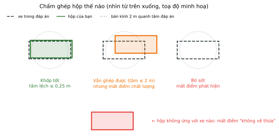

# RUBRIC.md — Bài được chấm thế nào

Thang 100 điểm. Coach chấm tự động sau buổi, so hộp của bạn với đáp án, dùng bản Save cuối cùng của từng job.

## Hộp nào được chấm

- Chỉ chấm hộp nhãn **`vehicles`**. Hộp nhãn khác (`two-wheels`, `pedestrian`, ...) không được cộng điểm và cũng không bị tính là vẽ thừa.
- Hộp có tâm nằm ngoài vùng 50 m × 50 m bị bỏ qua.
- Nhìn từ trên xuống, mỗi xe trong đáp án được ghép với **tối đa một** hộp của bạn: hộp chồng lên xe đó, hoặc có tâm cách tâm xe không quá 2 m.

## Sáu hạng mục

| Hạng mục | Điểm | Cách tính | Mất điểm khi |
| --- | ---: | --- | --- |
| Phát hiện | 30 | số xe ghép được / số xe trong đáp án × 30 | bỏ sót xe |
| Chất lượng hộp | 30 | trung bình trên các xe ghép được, mỗi xe gồm hai nửa: **tâm** lệch ≤ 0,25 m được 0,5, ≤ 0,5 m được 0,3; **kích thước** dài, rộng, cao sai trung bình ≤ 20% được 0,5 | tâm lệch, hộp co theo điểm, sai cỡ |
| Hướng | 15 | trung bình trên các xe ghép được: yaw lệch ≤ 5° đủ điểm, ≤ 10° được 0,6, lệch hơn hoặc lật đầu được 0 | xoay lệch, lật đầu |
| Đáy chạm đường | 5 | trung bình trên các xe ghép được: đáy hộp lệch ≤ 0,2 m đủ điểm, ≤ 0,4 m nửa điểm | đáy lơ lửng hoặc chìm |
| Không vẽ thừa | 10 | số hộp ghép được / số hộp `vehicles` bạn vẽ × 10 | hộp không ứng với xe nào |
| Nhất quán kích thước | 10 | số xe giữ đúng cỡ / số xe gặp lại ở ít nhất hai job × 10 | cùng một xe mà dài, rộng hoặc cao chênh quá 10% giữa các job |

Năm hạng mục đầu tính riêng cho từng job (tối đa 90) rồi lấy **trung bình ba job**. Job bỏ trống được 0 ở cả năm hạng mục. Hạng mục cuối xét cả ba job cùng lúc, cộng vào sau cùng.

Chất lượng hộp, hướng và đáy chỉ tính trên xe đã ghép được. Vẽ ít mà đẹp không bù được điểm phát hiện; vẽ nhiều cho chắc thì mất điểm không vẽ thừa.

## Hai lỗi bị chặn trần

Chỉ xét xe cách xe thu dữ liệu **dưới 15 m**, gộp cả ba job. Xe ở gần có hàng nghìn điểm, nên các lỗi này là do sơ suất chứ không do dữ liệu:

| Lỗi | Điểm tối đa của cả bài |
| --- | ---: |
| Bỏ sót hơn 10% số xe gần | 60 |
| Lật đầu dù chỉ **một** xe gần | 70 |

Dính cả hai thì lấy trần thấp hơn (60).

## Điểm chữ

| Điểm | Chữ |
| --- | :---: |
| ≥ 90 | A |
| ≥ 80 | B |
| ≥ 70 | C |
| ≥ 50 | D |
| < 50 | F |

## Ví dụ một job

Frame có 12 xe. Bạn vẽ 12 hộp `vehicles`, ghép được 11, một hộp vẽ vào khoảng trống. Trong 11 xe ghép được: 8 xe tâm lệch ≤ 0,25 m, 3 xe tâm lệch trong khoảng 0,25 – 0,5 m, cả 11 xe đều đúng cỡ; 10 xe đúng hướng, 1 xe lật đầu; đáy cả 11 xe đều chạm đường.

| Hạng mục | Tính | Điểm |
| --- | --- | ---: |
| Phát hiện | 11 / 12 × 30 | 27,50 |
| Chất lượng hộp | (8 × 1,0 + 3 × 0,8) / 11 × 30 | 28,36 |
| Hướng | 10 / 11 × 15 | 13,64 |
| Đáy chạm đường | 11 / 11 × 5 | 5,00 |
| Không vẽ thừa | 11 / 12 × 10 | 9,17 |
| **Cộng job** | | **83,67 / 90** |

Nếu xe bị lật đầu đó cách xe thu dữ liệu dưới 15 m, cả bài bị chặn ở 70, dù ba job cộng nhất quán kích thước có được 90.
